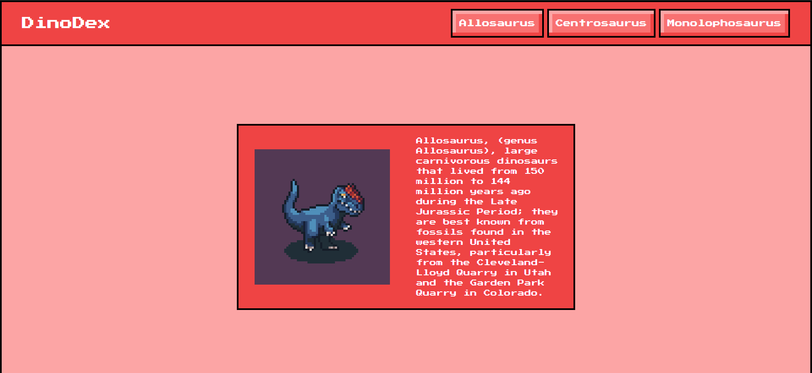

# NextJS Concepts

## Static and Dynamic sites

- Traditionally, React is used to make **Dynamic** apps which rely heavily on JavaScript and dynamic data fetching.
- Tons of websites don't require interaction or dynamic data fetching, these are called **Static** or **Content Driven** sites (i.e. Blogs, News, Wikis, etc).
- One of the primary goals of NextJS is to expand the use of React to static sites.

## File-Based Routing

- Files and folders created inside `src/app` determine what routes exist in your app.
- A route a user can visit **must** be defined with a file named `page.tsx`.
- A `page.tsx` file must export a component with a `export default` statement.
- The name of the component exported from `page.tsx` doesn't matter, it's only used for debugging.

Example routes:

| FileSystem                           | Route                                     |
| ------------------------------------ | ----------------------------------------- |
| src/app/page.tsx                     | http://localhost:3000/                    |
| src/app/performance/page.tsx         | http://localhost:3000/performance         |
| src/app/performance/details/page.tsx | http://localhost:3000/performance/details |

Example component:

```tsx
export default function HomePage() {
  return <div>Home Page</div>;
}
```

More: https://nextjs.org/docs/pages/building-your-application/routing/pages-and-layouts

## Page Layouts

- NextJS allows to have common UI elements between pages with the `layout.tsx` file.
- The `layout.tsx` is a wrapper around our pages.
- Whenever we render any page, that page is rendered as a child of `layout.tsx`.

The following `layout.tsx` attaches a `Header` component to all pages:

```tsx
//src/app/layout.tsx

export default function RootLayout({
  children,
}: Readonly<{
  children: React.ReactNode;
}>) {
  return (
    <html lang="en" className="bg-red-300">
      <body className={inter.className}>
        <Header />
        {children} {/* Any page from src/app */}
      </body>
    </html>
  );
}
```

_Navbar in http://localhost:3000/allosaurus_



_Navbar in http://localhost:3000/centrosaurus_


More: https://nextjs.org/docs/pages/building-your-application/routing/pages-and-layouts#layout-pattern

## Displaying images

- To add images to a page in NextJS it's recommended to use the `Image` component from `next/image`, which is an extension of the `HTML` tag.
- It optimizes images for each user's device, meaning that NextJS will resize an image appropiately depending on the device (browser, mobile, etc). This process occurs only once and then the results are cached.
- It prevents [Layout Shifting](https://nextjs.org/learn-pages-router/seo/web-performance/cls).
- It can be used with locally or remote hosted images.

More: https://nextjs.org/docs/pages/building-your-application/optimizing/images

## Solving Layout Shifting

Layout Shifting is when elements shift position when new elements render on the screen. It usually occurs when something takes a lot of time to load.


The way to avoid it is to always size your elements. In the case of images, [always size your images](https://web.dev/articles/optimize-cls#images-without-dimensions).

The `Image` component from `Next/image` promotes best practices, so you'll be forced to size your images in one of three ways:

- Automatically, by importing a local hosted image. The `Image` element from `Next/image` automatically gets the dimensions of the file imported.
- Explicitly, by including `width` and `height` attributes.
- Implicitly, by using the `fill` attribute which causes the image to expand to fill its parent element.

With no layout shifting, this is what we get. This can be further improved with a placeholder or loadind state:


